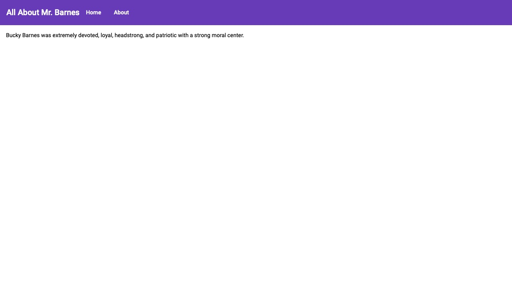

We'll set up Angular Material in our project and build our application UI using Material components.

Go to your terminal and run this command from the root of your project:

`ng add @angular/material`{{execute}}

You’ll be prompted to choose the theme, so let’s pick **Deep Purple/Amber**.

For the other questions - whether you want to set up HammerJS for gesture recognition and if you want to set up browser animations for Angular Material - press Enter to use the default answers.

Open the  `angularly/src/app/app.module.ts`{{open}}  file and add the following imports:

```javascript
import { MatToolbarModule } from '@angular/material/toolbar';
import { MatIconModule } from '@angular/material/icon';
import { MatCardModule } from '@angular/material/card';
import { MatButtonModule } from '@angular/material/button';
import { MatProgressSpinnerModule } from '@angular/material/progress-spinner';
```

We imported the modules for these Material Design components:

- MatToolbar that provides a container for headers, titles, or actions.
- MatCard that provides a content container for text, photos, and actions in the context of a single subject.
- MatButton that provides a native  `<button>`  or  `<a>`  element enhanced with Material Design styling and ink ripples.
- MatProgressSpinner that provides a circular indicator of progress and activity.

Next, add these modules to the imports array in the same file:

```javascript
@NgModule({
  declarations: [
    AppComponent,
    BuckyComponent,
    AboutComponent
  ],
  imports: [
    BrowserModule,
    AppRoutingModule,
    HttpClientModule,
    BrowserAnimationsModule,
    MatToolbarModule,
    MatIconModule,
    MatButtonModule,
    MatCardModule,
    MatProgressSpinnerModule
  ],
  providers: [],
  bootstrap: [AppComponent]
})
export class AppModule { }
```

Next, open the  `angularly/src/app/app.component.html`{{open}}  file and replace all it's code with the following:

```html
<mat-toolbar color="primary">  
<h1>  
All About Mr. Barnes
</h1>  
<button mat-button routerLink="/">Home</button>  
<button mat-button routerLink="/about">About</button></mat-toolbar><router-outlet></router-outlet>
```

We added a top navigation bar with two buttons that take us to the home and about pages, respectively.

Let's run the app now `ng serve`{{execute}} and click on the `ngServe` tab again you'll see the new home page

