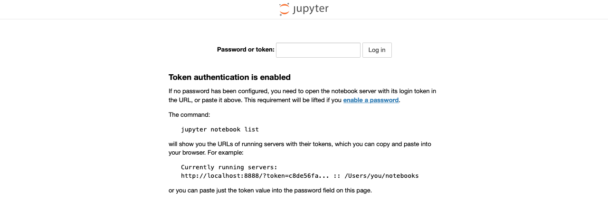
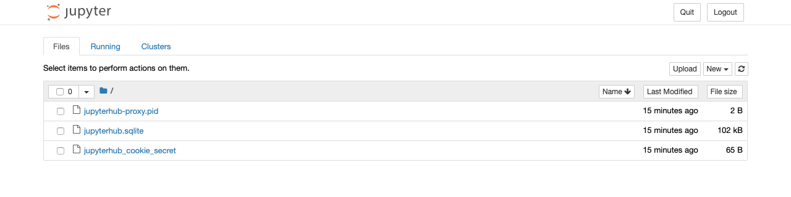
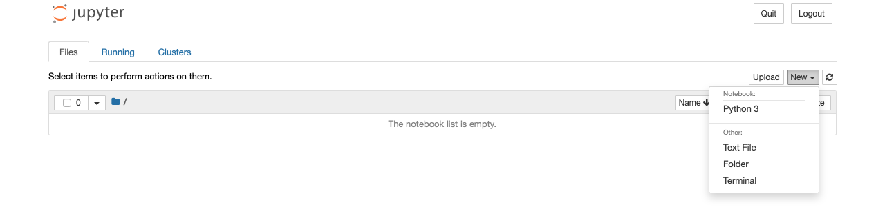
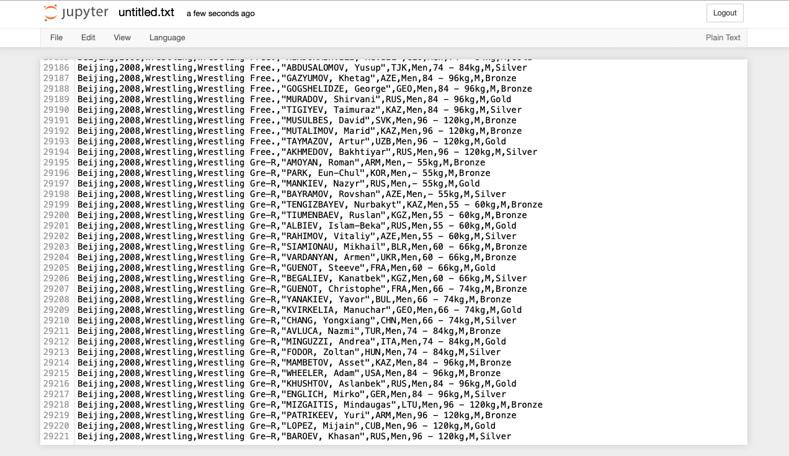
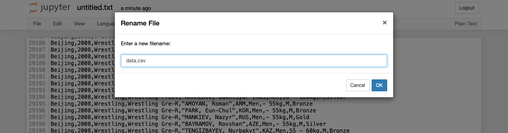
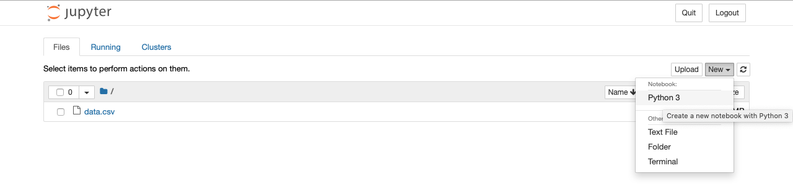
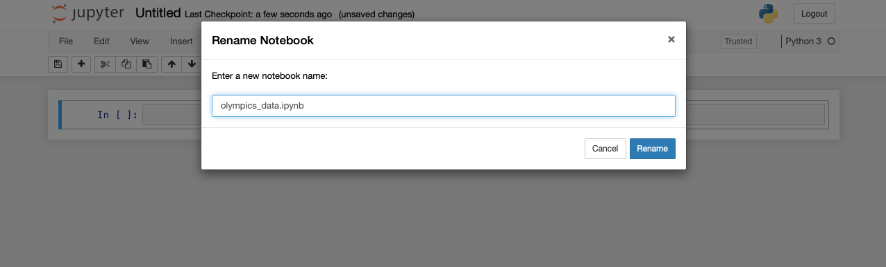

# Creating data visualisations

We will becreating visulaisations of all Olympic gold medatlists since the start of Athen Olympics in 1896 till 2008.Open the Jupyter notebook and copy token from terminal onto the authentication field to connect.

## Running the Notebook 

`jupyter-notebook --ip=0.0.0.0 --port=9999 --allow-root`{{execute}}

You'll see output similar to 

```bash
root@78fe43fce333:~# jupyter-notebook --ip=0.0.0.0 --port=9999
[I 17:51:30.700 NotebookApp] Writing notebook server cookie secret to /home/scrapbook/tutorial/.local/share/jupyter/runtime/notebook_cookie_secret
[C 17:51:31.644 NotebookApp] Running as root is not recommended. Use --allow-root to bypass.
root@78fe43fce333:~# jupyter-notebook --ip=0.0.0.0 --port=9999 --allow-root
[I 17:51:42.575 NotebookApp] Serving notebooks from local directory: /home/scrapbook/tutorial
[I 17:51:42.575 NotebookApp] The Jupyter Notebook is running at:
[I 17:51:42.575 NotebookApp] http://(78fe43fce333 or 127.0.0.1):9999/?token=47e1cdbbc9ec8b6017854f93fbcfb453089e69424c8a6305
[I 17:51:42.575 NotebookApp] Use Control-C to stop this server and shut down all kernels (twice to skip confirmation).
[W 17:51:42.579 NotebookApp] No web browser found: could not locate runnable browser.
[C 17:51:42.579 NotebookApp]

    To access the notebook, open this file in a browser:
        file:///home/scrapbook/tutorial/.local/share/jupyter/runtime/nbserver-61-open.html
    Or copy and paste one of these URLs:
        http://(78fe43fce333 or 127.0.0.1):9999/?token=47e1cdbbc9ec8b6017854f93fbcfb453089e69424c8a6305
```

Note down the token value in `token=47e1cdbbc9ec8b6017854f93fbcfb453089e69424c8a6305`

Click on the `jupyter-notebook` tab and in the page that opens, paste this value in the password or token field.



This should take you to the notebook dashboard 



## Adding data

In the Files tab click on "New" tab on top right, and choose option textfile. 



Download the file [Summer Olympics Data](https://docs.google.com/spreadsheets/d/1zeeZQzFoHE2j_ZrqDkVJK9eF7OH1yvg75c8S-aBcxaU/edit#gid=0) and paste all it's content to this file. 



Click on untitled.txt and enter name `data.csv` to the dialog that opens.



We will use this data to  draw different visualisations for our exercise. Return to the previous tab in your browser and you'll notice a data.csv file in the Files tab. Lets add code for data visualisations

## Creating Notebook

Choose New > Python 3 in the files tab to create a new Python Note book.



Raname the file to `olympics_data.ipynb`. 



Lets add visulisation code now

Paste the following to the notebook and hit Run button

```python
import pandas as pd
```

Next add following lines of code to read the data.csv file

```python
data = pd.read_csv('data.csv', skiprows=4)
data
```


When you hit Run button this should display all the data in the csv file to the browser window. We can import the Matplotlib library using the following code. Write the following code inside the next Jupyter Notebook cell, and hit Run

```python
import matplotlib.pyplot as plt
%matplotlib inline
```

***Plot Types***

There is a kind of Plot types which are following.

1. plot(kind=line): It is best when we need to track the changes over some time.

2. plot(kind=bar): Bar graphs are best for comparing the groups.

3. plot(kind=pie): Best for comparing the parts of a whole system.

Now let’s take an example of one by one chart in Jupyter Notebook. Let’s plot a graph of different sports takes part in the Olympics Edition 2008. We have already imported the matplotlib.pyplot library in the Notebook, now we will use that to plot the graph of different sports.

### Plot a Line Chart using Matplotlib.pyplot Library

We will display the line chart. So let’s add the following code in the Jupyter Notebook.

```python
filteredData = data[data.Edition == 2008]
filteredData.Sport.value_counts().plot()
```


### Plot a Bar Chart using Matplotlib.pyplot Library

We can also display the bar chart instead of the line chart. We need to pass a parameter kind and value to the bar, and it will show the bar chart. See the following example. Write the following code in the cell.

```python
filteredData = data[data.Edition == 2008]
filteredData.head()
filteredData.Sport.value_counts().plot(kind='bar')
```


### We can also get the Horizontal plot using the following code

```python
filteredData.Sport.value_counts().plot(kind='barh')
```


### Plot a Pie Chart using Matplotlib.pyplot Library

We can also display the pie chart instead of the bar chart. We need to pass a parameter kind and value to the pie, and it will show the bar chart. See the following example. Write the following code in the cell.

```python
filteredData = data[data.Edition == 2008]
filteredData.head()
filteredData.Sport.value_counts().plot(kind='pie')
```


