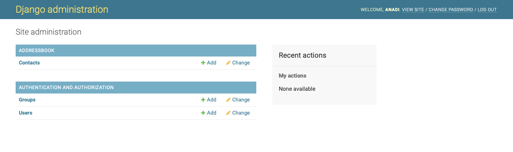

# Introducing the Django Admin

## Creating an admin user

First we’ll need to create a user who can login to the admin site. Run the following command:

`python3 manage.py createsuperuser`{{execute}}

Enter your desired username and press enter.

`Username: admin`

You will then be prompted for your desired email address:

`bryan@thedollery.com`

The final step is to enter your password. You will be asked to enter your password twice, the second time as a confirmation of the first.

```bash
Password: **********
Password (again): *********
Superuser created successfully.
```

## Using the Admin Dashboard 

Start the development server

`python3 manage.py runserver`{{execute}}

Browse to `https://[[HOST_SUBDOMAIN]]-8000-[[KATACODA_HOST]].environments.katacoda.com/admin/` you'll see the admin login, login with your credentials


Now, try logging in with the superuser account you created in the previous step. You should see the Django admin index page:


You should see a few types of editable content: groups and users. They are provided by django.contrib.auth, the authentication framework shipped by Django

## Make the addressbook app modifiable in the admin

But where’s our poll app? It’s not displayed on the admin index page.

Only one more thing to do: we need to tell the admin that `Contact` objects have an admin interface. To do this, open the `contacts/addressbook/admin.py`{{open}} file, and edit it to look like this:

<pre class="file" data-filename="contacts/addressbook/admin.py" data-target="replace">
from django.contrib import admin

from .models import Contact

admin.site.register(Contact)
</pre>

Refresh the admin panel browser window and you should see that Contacts are available too



You can try all the CRUD operations on the `Contact` model from here.
