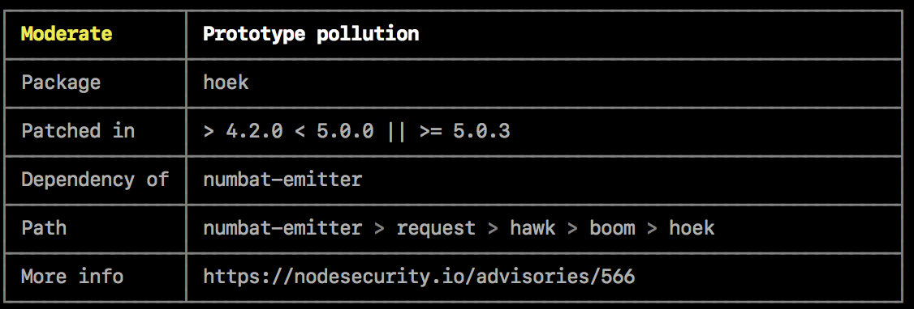
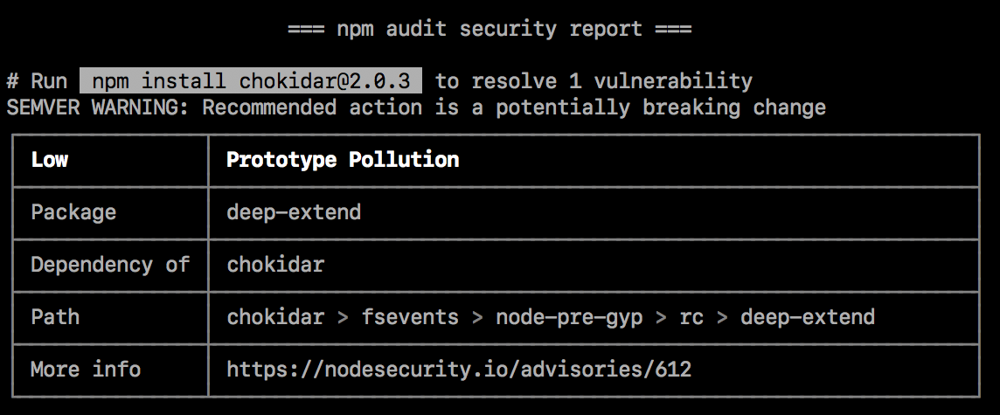

# Code security audits with npm-audit

## About audit reports

Audit reports contain tables of information about security vulnerabilities in your project’s dependencies to help you fix the vulnerability or troubleshoot further.



Vulnerability table fields

- Severity
- Description
- Package
- Patched in
- Dependency of
- Path
- More information

### Severity

The severity of the vulnerability, determined by the impact and exploitability of the vulnerability in its most common use case.

| Severity | Recommended action |
| ------------- |:-------------:|
| Critical | Address immediately |
| High | Address as quickly as possible |
| Moderate | Address as time allows |
| Low | Address at your discretion |

### Description

The description of the vulnerability. For example, “Denial of service”.

### Package

The name of the package that contains the vulnerability.

### Patched in

The semantic version range that describes which versions contain a fix for the vulnerability.

### Dependency of

The module that the package with the vulnerability depends on.

### Path

The path to the code that contains the vulnerability.

### More info

A link to the security report.

## Running npm audit

Make sure you are in the `my_node_app` directory

`npm audit`{{execute}}

You'll see output similar to:

```bash
                       === npm audit security report ===

found 0 vulnerabilities
 in 50 scanned packages
```

### Security vulnerabilities found with suggested updates

If security vulnerabilities are found and updates are available, you can either:

Run the `npm audit fix` subcommand to automatically install compatible updates to vulnerable dependencies.
Run the recommended commands individually to install updates to vulnerable dependencies. (Some updates may be semver-breaking changes; for more information.)



`clear`{{execute}}